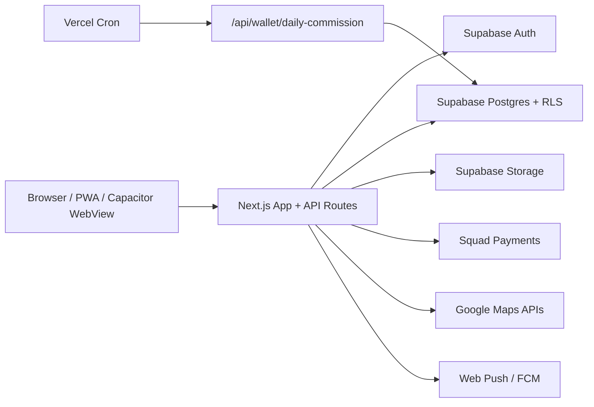

# Architecture And Trust Boundaries

## Repository And Technology Snapshot

Detected stack:

- Next.js 15.5 app router, React 19, TypeScript.
- Supabase Auth, database, storage, RLS, realtime.
- Squad payments for delivery checkout, marketplace checkout, wallet top-up, bank/account lookup.
- Google Maps/Routes/Places APIs.
- PWA service worker plus Capacitor Android/iOS native wrapper.
- Vercel cron for daily wallet commission.

Key files:

- `package.json` - app dependencies and build scripts.
- `middleware.ts` - web route protection and role redirects.
- `supabase-schema.sql` - tables, functions, RLS, storage policies.
- `app/api/**/route.ts` - API surface.
- `public/sw.js` - service worker, offline queue, push notifications.
- `capacitor.config.ts`, `android/`, `store-submission/` - native packaging.

## High-Level Flow

## Trust Boundaries

| Boundary | Trusted Side | Untrusted Or Semi-Trusted Side | Main Risk |
| --- | --- | --- | --- |
| Browser to Next API | Server route code | User-controlled request body, cookies, query params, uploaded files | Broken object/function authorization, tampering, replay, resource abuse |
| Browser to Supabase direct client | RLS policies and database functions | Authenticated users using public anon/publishable key | RLS must protect every table/column because users can call Supabase directly |
| Next API to Supabase service role | API routes after app-level auth | Service role bypasses RLS | Any weak API auth becomes full data access |
| Admin UI/API | Admin session and optional Supabase admin profile | Public internet and stolen/admin cookie | Fallback credentials, CSRF, broad mutations |
| Payment provider callback | Server verification with Squad secret | Browser callback parameters | Missing webhook/signature reconciliation |
| Service worker | Cached assets, push handler | Offline stored request bodies, notification payload data | Private page cache, replay, unsafe notification URLs |
| Native wrapper | Android/iOS app package | Reverse engineered app assets and bundled public keys | Public keys must rely on RLS, not secrecy |

## Sensitive Data Classes

- Auth identity: Supabase user id, email, phone, session cookies.
- Role and KYC state: `users.role`, `profiles.account_type`, `profiles.is_admin`, rider/business application status.
- Location: pickup/dropoff, live rider location, latest user location.
- Financial: wallet balances, transactions, bank details, withdrawals, Squad references.
- Documents/photos: rider/business KYC documents, profile photos, delivery proofs.
- Push: FCM token, web push endpoint/keys.

## Missing Or Inaccessible Information

- Production Supabase grants and actual deployed schema state.
- Production Vercel environment variable values.
- Supabase dashboard Auth settings, SMTP settings, OAuth provider settings.
- Google/Squad dashboard key restrictions and webhook configuration.
- Runtime logs, SIEM/alerting, backup retention, incident response runbooks.
- Play Console and Firebase project configuration.

## Architecture Notes

The most important architectural rule for this app is: **anything readable or writable through the browser Supabase client must be protected by RLS and column-safe policies.** Supabase public keys are expected to be recoverable from browser/mobile packages; the database must not trust client-side UI restrictions.

