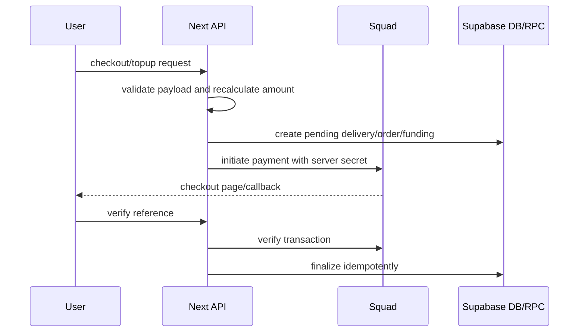

# Payment And Wallet Review

## Payment Flow Summary

## Good Controls

| Control | Evidence | Notes |
| --- | --- | --- |
| Server-side delivery quote | `app/api/deliveries/checkout/route.ts:77-115` | Rejects mismatched client total. |
| Server-side marketplace estimate | `app/api/marketplace/checkout/route.ts:77-84` | Rejects mismatched client amount. |
| Authenticated payment verify | `app/api/deliveries/verify/route.ts:26-34`, `app/api/marketplace/verify/route.ts:25-33`, `app/api/wallet/verify/route.ts:20-29` | User must be signed in before verify finalization. |
| Provider reference match | `app/api/deliveries/verify/route.ts:47-50` | Delivery payment reference is matched to metadata. |
| Amount match | `app/api/deliveries/verify/route.ts:78-81`, `app/api/marketplace/verify/route.ts:66-68`, `supabase-schema.sql:1136-1138` | Prevents underpayment credit. |
| Wallet funding idempotency | `supabase-schema.sql:1099-1156` | Locks transaction/wallet and returns if already successful. |
| Wallet checkout idempotency | `supabase-schema.sql:1206-1302` | Locks delivery/wallet and prevents duplicate successful delivery payment. |
| Withdrawal controls | `supabase-schema.sql:1566-1762` | KYC approved, min/max, 24h limit, locked balance, admin review. |

## Gaps

| Gap | Evidence | Risk |
| --- | --- | --- |
| No payment webhook/signature route found | `lib/payments/squad.ts:94-145`, verify routes only | Browser callback is not enough for robust reconciliation. |
| Admin role escalation affects wallet/admin functions | `supabase-schema.sql:1032-1037`, `1674-1676` | Once F-001 is fixed, these controls become much stronger. |
| Daily commission public if secret missing | `app/api/wallet/daily-commission/route.ts:49-54` | Privileged batch job can be externally triggered. |
| Payment raw payload stored in metadata | `app/api/deliveries/verify/route.ts:52-61`, `83-95`; wallet verify stores `squad_raw` | Ensure no card PAN/secret data is stored. |

## Daily Commission Current Behavior

The current code deducts commission from **new earnings for the Lagos business date**, not from existing wallet balance when there were no new earnings:

- `app/api/wallet/daily-commission/route.ts:33-42` returns `commissionBasis: "new_earnings"`.
- `app/api/wallet/daily-commission/route.ts:150-158` calculates earnings and skips if earnings are `<= 0`.
- `app/api/wallet/daily-commission/route.ts:169-172` calculates commission from earnings and caps by current balance.
- `app/api/wallet/daily-commission/route.ts:206-240` reads only same-day successful rider earnings or business order checkout funding.

This matches the business rule discussed earlier: no earnings that day means no daily commission deduction.

## Required Before Production

1. Fix F-001 before relying on any admin/owner wallet check.
2. Add signed Squad webhook reconciliation.
3. Require `CRON_SECRET`.
4. Review stored payment metadata for data minimization.
5. Add ledger reconciliation tests for top-up, delivery wallet payment, marketplace business credit, withdrawals, refunds, and commission.

